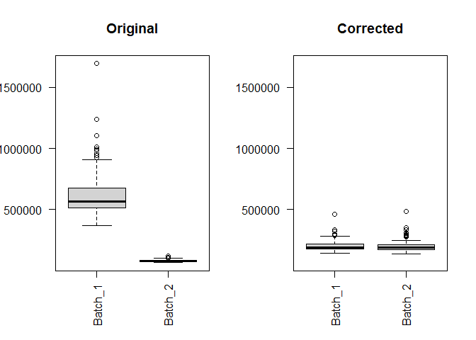

LFQ Data Set Cleanup and Harmonization
================
Sebastian Wolf

- <a href="#motivation" id="toc-motivation">Motivation</a>
- <a href="#loading-qc-and-filtering"
  id="toc-loading-qc-and-filtering">Loading, QC and Filtering</a>
  - <a href="#loading" id="toc-loading">Loading</a>
  - <a href="#qc---ffm" id="toc-qc---ffm">QC - FFM</a>
  - <a href="#qc---sal" id="toc-qc---sal">QC - SAL</a>
  - <a href="#harmonization" id="toc-harmonization">Harmonization</a>
- <a href="#imputation---combat-merge"
  id="toc-imputation---combat-merge">Imputation - ComBat merge</a>
- <a href="#multiassayexperiment-class"
  id="toc-multiassayexperiment-class">MultiAssayExperiment Class</a>
  - <a href="#lfq-data" id="toc-lfq-data">LFQ Data</a>
  - <a href="#sal-data" id="toc-sal-data">SAL Data</a>
  - <a href="#merged-data" id="toc-merged-data">Merged Data</a>
- <a href="#session-info" id="toc-session-info">Session Info</a>

``` r
library(tidyverse)
library(sva)
library(HarmonizR)
```

# Motivation

We have two independent data sets from untreated AML patients (we call
them FFM and SAL), both including \>100 samples. For combined analyses
of both data sets, cleaning, imputation and batch correction need to be
performed on the merged data set.

We will perform the following steps in this particular order

1.  QC/filtering
2.  normalization/transformation using vsn
3.  imputation
4.  harmonization and batch removal

# Loading, QC and Filtering

## Loading

For a detailed explanation of how and why these steps are performed for
each data set, see also [this
vignette](https://github.com/Oellerich-Lab/Proteogenomics/blob/main/Proteomic_data_processing/20220306_lfq_proteome_normalization_cleanup.qmd)

``` r
prot_ffm_unimputed <- readxl::read_excel("~/Forschung/AG Oellerich/Datensätze/FFM_Discovery_Cohort/FFM_Proteomics/FFM_AML_Discovery_Cohort_LFQ_Proteome.xlsx")

prot_sal_unimputed <- read_delim("~/Forschung/AG Oellerich/Datensätze/SALII_Cohort/SALII_Proteomics/AML revision115 samples_spectronaut version 15_unimputed.txt", delim = "\t")
```

## QC - FFM

Remove unwanted column, retain PG.UniProtIds and remove samples with
\>30% missingness and proteins with \<50% coverage in the remaining
samples

``` r
prot_ffm_unimputed %>% 
  dplyr::select(starts_with("F"), PG.UniProtIds) -> prot_ffm_unimputed

# set rownames
prot_ffm_unimputed %>% 
  column_to_rownames("PG.UniProtIds") -> prot_ffm_unimputed

# mutate as numeric and transform to matrix
prot_ffm_unimputed %>% 
  mutate(across(everything(), ~ as.numeric(.))) %>% 
  as.matrix() -> prot_ffm_unimputed

# change nan to NA
prot_ffm_unimputed[is.nan(prot_ffm_unimputed)] <- NA
```

``` r
# calculate missing proteins/sample and filter <= 30%
matrixStats::rowSums2(is.na(t(prot_ffm_unimputed)) / nrow(prot_ffm_unimputed))*100 <= 30 -> good_coverage_samples

prot_ffm_unimputed[, good_coverage_samples] -> prot_ffm_unimputed

dim(prot_ffm_unimputed)
```

    [1] 6536  169

``` r
# calculate missing samples/protein and filter <= 50%
matrixStats::rowSums2(is.na(prot_ffm_unimputed)/ncol(prot_ffm_unimputed)) * 100 <= 50 -> good_coverage_proteins

prot_ffm_unimputed[good_coverage_proteins, ] -> prot_ffm_unimputed
```

log2-like transformation

``` r
prot_ffm_unimputed <- 2^prot_ffm_unimputed
vsn::justvsn(prot_ffm_unimputed) -> prot_ffm_unimputed
```

## QC - SAL

The revisin cohort includes 100 re-meassured AML patients (marked with
“AMLR”) as well as the proteome of CD34+ HSCs from 13 healthy subjects.
We will keep both data sets, since the comparison of diseased
vs. healthy cells is of great interest

``` r
# transformation for usability
# make generic names
# first extract only the informative substring in the names using positive look ahead and look behind
prot_sal_unimputed %>% 
  dplyr::select(contains("AMLR"), contains("CD34cells"),  PG.ProteinAccessions) %>% 
  dplyr::slice(-1) %>% 
  rename_with(.cols = -PG.ProteinAccessions, .fn = function(n) { 
    stringr::str_extract(string = n, "(?<=DIAproteome_)(.*?)(?=.raw)") }) %>%
  #remove the weird "D" in the CD34 names as well
  rename_with(.cols = contains("CD34cells"), .fn = function(n) {
    stringr::str_remove(string = n, pattern = "(?<=H)D")
  }) %>% 
  column_to_rownames("PG.ProteinAccessions") %>% 
  mutate(across(everything(), ~ as.numeric(.))) %>% 
  as.matrix() -> prot_sal_unimputed

# NA instead of NaN
prot_sal_unimputed[is.nan(prot_sal_unimputed)] <- NA
```

We apply the same filtering strategy to the SAL data set (remove samples
with \<30% coverage and proteins with \>50% missingness)

``` r
matrixStats::rowSums2(is.na(t(prot_sal_unimputed)) / nrow(prot_sal_unimputed))*100 <= 30 -> good_coverage_samples_sal

matrixStats::rowSums2(is.na(prot_sal_unimputed)/ncol(prot_sal_unimputed)) * 100 <= 50 -> good_coverage_proteins_sal

prot_sal_unimputed[good_coverage_proteins_sal, good_coverage_samples_sal] -> prot_sal_unimputed
```

``` r
prot_sal_unimputed %>% 
  as_tibble(rownames = "uniprotid") %>% 
  pivot_longer(cols = -uniprotid, names_to = "sample", values_to = "vsn") %>% 
  ggplot(aes(x=sample, y = vsn, fill = factor(sample %in% c( "AMLR35", "AMLR60", "AMLR70", "AMLR79", "CD34cells_H4")))) + geom_boxplot() +
  cowplot::theme_cowplot() +
  theme(axis.text.x = element_text(angle = 90, hjust = 1, vjust = 0.5), legend.position = "none")
```


There are 5 samples which apparently have an QC issue with a very
truncated lower bond

- AMLR35
- AMLR60
- AMLR70
- AMLR79
- CD34_cells_H4

For a stringent QC, these 5 samples will be removed from further
analyses

``` r
prot_sal_unimputed[, !colnames(prot_sal_unimputed) %in% c( "AMLR35","AMLR60", "AMLR70", "AMLR79", "CD34_cells_H4")] -> prot_sal_unimputed
prot_sal_unimputed <- 2^prot_sal_unimputed
vsn::justvsn(prot_sal_unimputed) -> prot_sal_unimputed
```

``` r
prot_sal_unimputed %>% 
  as_tibble(rownames = "uniprotid") %>% 
  pivot_longer(cols = -uniprotid, names_to = "sample", values_to = "vsn") %>% 
  ggplot(aes(x=sample, y = vsn)) + geom_boxplot() +
  cowplot::theme_cowplot() +
  theme(axis.text.x = element_text(angle = 90, hjust = 1, vjust = 0.5), legend.position = "none")
```


While there are still two or three samples left with peculiar spread
(i.e. R14 or CD34H5) the overall cohort looks fairly homogenous.

## Harmonization

Botch data sets (FFM and SAL) were measured using the same machine setup
and an label free, data independent acquisition. However, Comparing both
data sets it is obvious that there’s a significant technical batch
effect that clearly separates both data sets and renders underlying
analyses impossible.

There exist in principal two ways to harmonize proteomic data sets, one
is to run a joined library search on both data sets and let the internal
normalization algorithm take control (see (Cox et al. 2014)).
Alternatively, data set harmonization can be done on the protein level.
Here we will explore the latter approach. Merging proteomic data sets
comes with certain caveats one of which is the need to handle large
fraction of missing values. Popular algorithms for batch correction such
as sva’s combat (Johnson, Li, and Rabinovic 2007) and limmas
removeBatchEffect() (Smyth 2004) were developed with genetic data sets
in mind which usually have only very low frequency of missing values.
However in proteomics, the dual nature of missing values (not at random
i.e. abundance below the detection threshold of the machine alongside
missing at random due to the stochastic nature of missingnes) makes
removing and imputing missing values challenging. (Voß et al. 2022)
propose a missing value-dependent framework around combat and
removeBatchEffect() that splits the data set depending on the missing
value pattern and applies batch correction independently on these
subsets of data (see graphical workflow below). Furthermore, in the
paper they explore different sequences of merging and missing value
imputation and claim that, while missing value imputation is generally
not advised b/c most algorithm fail to capture the complex nature of
missing values in proteomics, where necessary imputation should take
place before data set merging. This is because when imputing missing
values after merging, there’s a high risk that the algorithm again
amplifies data patterns that are linear to the batch. Of course, after
imputation, harmonizR workflow is not necessary and the generic combat
workflow can be used.


Hence in our case, we will use two different approaches. Since for some
down stream analyses, missing value imputation is needed, we will 1)
create a harmonized data set including missing values using the
harmonizR framework and 2) impute both data sets independently and merge
them using combat.

For this approach, we don’t need to pre specify the intersect proteins
and give the full data set for merging.

``` r
intersect(rownames(prot_ffm_unimputed), rownames(prot_sal_unimputed)) -> intersect_proteins

# cbind(
#   prot_ffm_unimputed[intersect_proteins,],
#   prot_sal_unimputed[intersect_proteins,]
# ) -> prot_merge
```

Create a batch vector to identify FFM and SAL

harmonizR expects a data frame with three columns

1.  sample name that equals sample labeling from the proteomic data

2.  sample id

3.  numerical batch (FFM = 1, SAL = 2)

``` r
tibble(samplename = c(colnames(prot_ffm_unimputed), colnames(prot_sal_unimputed))) %>% 
  mutate(batch = factor(stringr::str_starts(string = samplename, pattern = "F"), levels=c(F,T), labels=c(2, 1))) %>% 
 rowid_to_column("ID") %>% 
  relocate(ID, .after = samplename) %>% 
  as.data.frame() -> batch_vector
```

To infer the success of the harmonization, we first plot the two
uncorrected data sets using the sample-wise distributions and a PCA plot

``` r
prot_ffm_unimputed %>% 
  as_tibble(rownames = "proteinid") %>% 
  pivot_longer(cols = -proteinid, names_to = "sample", values_to = "intensity") -> prot_ffm_unimputed.long

prot_sal_unimputed %>% 
  as_tibble(rownames = "proteinid") %>% 
  pivot_longer(cols = -proteinid, names_to = "sample", values_to = "intensity") -> prot_sal_unimputed.long

rbind(prot_ffm_unimputed.long, prot_sal_unimputed.long) %>% 
  mutate(batch = factor(stringr::str_starts(string = sample, pattern = "F"), 
                        levels=c(T,F), 
                        labels=c("FFM","SAL"))) %>% 
  ggplot(aes(x=sample, y = intensity, fill = batch)) +
  geom_boxplot(outlier.shape = NA) +
  cowplot::theme_cowplot() +
  theme(axis.text.x = element_blank())

cbind(prot_ffm_unimputed[intersect_proteins,], prot_sal_unimputed[intersect_proteins,]) %>% 
  t() %>% 
  pcaMethods::pca() %>% 
  pcaMethods::scores() %>% 
  as_tibble(rownames = "sample") %>% 
  mutate(batch = factor(stringr::str_starts(string = sample, pattern = "F"), 
                        levels=c(T,F), 
                        labels=c("FFM","SAL"))) %>% 
  ggplot(aes(x = PC1, y = PC2, col = batch)) +
  geom_point() +
  cowplot::theme_cowplot()
```


Batch comparison

Since combat can be run in parametric and non-parametric mode, we will
use and compare botch approaches.

First we need to join both data sets and will use a inner join on the
proteinid column for this in order to preserve all identified proteins.
Additionally, we’ll subject the data set to missing value imputation
using (Ma et al., n.d.) DreamAI.

``` r
prot_ffm_unimputed %>% 
  as_tibble(rownames = "proteinid") -> prot_ffm_unimputed.wide

prot_sal_unimputed %>% 
  as_tibble(rownames = "proteinid") -> prot_sal_unimputed.wide

prot_ffm_unimputed.wide %>% 
  inner_join(prot_sal_unimputed.wide, by=c("proteinid")) %>% 
  column_to_rownames("proteinid") %>% 
  as.data.frame() -> prot_merge.unimputed.uncorrected

#saveRDS(prot_merge.unimputed.uncorrected, "prot_merge.unimputed.uncorrected.RDS")
```

``` r
HarmonizR::harmonizR(data_as_input = prot_merge.unimputed.uncorrected, 
                     description_as_input = batch_vector, 
                     algorithm = "ComBat", 
                     ComBat_mode = 1, 
                     plot = "samplemeans") -> prot_merge.unimputed.combat_parametric
```

    [1] "Reading the files..."
    [1] "Preparing..."
    [1] "Splitting the data using ComBat adjustment..."
    [1] "Rebuilding..."
    [1] "Visualizing sample means..."


    [1] "Termination."

``` r
HarmonizR::harmonizR(data_as_input = prot_merge.unimputed.uncorrected, 
                     description_as_input = batch_vector, 
                     algorithm = "ComBat", 
                     ComBat_mode = 3, 
                     plot = "samplemeans") -> prot_merge.unimputed.combat_nonparametric
```

    [1] "Reading the files..."
    [1] "Preparing..."
    [1] "Splitting the data using ComBat adjustment..."
    [1] "Rebuilding..."
    [1] "Visualizing sample means..."



    [1] "Termination."

``` r
# saveRDS(prot_merge.unimputed.combat_parametric, "prot_merge.unimputed.combat_parametric.RDS")
# saveRDS(prot_merge.unimputed.combat_nonparametric, "prot_merge.unimputed.combat_nonparametric.RDS")
```

``` r
# use the pre-calculated data set
# prot_merge.unimputed.combat_parametric <- readRDS("prot_merge.unimputed.combat_parametric.RDS")
# prot_merge.unimputed.combat_nonparametric <- readRDS("prot_merge.unimputed.combat_nonparametric.RDS")
```

We will compare the results of the parametric and non-parametric
harmonization

``` r
prot_merge.unimputed.combat_parametric %>% 
  as_tibble(rownames = "proteinid") %>% 
  pivot_longer(cols = -proteinid, names_to = "sample", values_to = "intensity") %>% 
  mutate(batch = factor(stringr::str_starts(string = sample, pattern = "F"), 
                        levels=c(T,F), 
                        labels=c("FFM","SAL"))) %>% 
  ggplot(aes(x=sample, y = intensity, fill = batch)) +
  geom_boxplot(outlier.shape = NA) +
  cowplot::theme_cowplot() +
  theme(axis.text.x = element_blank())

prot_merge.unimputed.combat_nonparametric %>% 
  as_tibble(rownames = "proteinid") %>% 
  pivot_longer(cols = -proteinid, names_to = "sample", values_to = "intensity") %>% 
  mutate(batch = factor(stringr::str_starts(string = sample, pattern = "F"), 
                        levels=c(T,F), 
                        labels=c("FFM","SAL"))) %>% 
  ggplot(aes(x=sample, y = intensity, fill = batch)) +
  geom_boxplot(outlier.shape = NA) +
  cowplot::theme_cowplot() +
  theme(axis.text.x = element_blank())

prot_merge.unimputed.combat_parametric %>% 
  t() %>% 
  pcaMethods::pca() %>% 
  pcaMethods::scores() %>% 
  as_tibble(rownames = "sample") %>% 
  mutate(batch = factor(stringr::str_starts(string = sample, pattern = "F"), 
                        levels=c(T,F), 
                        labels=c("FFM","SAL"))) %>% 
  ggplot(aes(x = PC1, y = PC2, col = batch)) +
  geom_point() +
  cowplot::theme_cowplot()


prot_merge.unimputed.combat_nonparametric %>% 
  t() %>% 
  pcaMethods::pca() %>% 
  pcaMethods::scores() %>% 
  as_tibble(rownames = "sample") %>% 
  mutate(batch = factor(stringr::str_starts(string = sample, pattern = "F"), 
                        levels=c(T,F), 
                        labels=c("FFM","SAL"))) %>% 
  ggplot(aes(x = PC1, y = PC2, col = batch)) +
  geom_point() +
  cowplot::theme_cowplot()
```


Sample-wise densities combat

Notably, there’s not much difference between the two approaches and
we’ll hence stick to the non parametric mode to avoid making assumptions
about the underlying distribution.

``` r
#write_rds(prot_merge.unimputed.combat_nonparametric, file = "ffm_sal_merge.unimputed.combat_nonparametric.RDS")
```

# Imputation - ComBat merge

For some analyses (e.g. clustering) we would need an imputed (hence no
missing values) data set. For this, imputation using the DreamAI (Ma et
al. 2021) will be performed on the individual data sets followed by
non-parametric combat merge. This appears to be the optimal strategy
when imputation is unavoidable.

``` r
#prot_ffm_unimputed %>% saveRDS("prot_ffm_unimputed.RDS")
#prot_sal_unimputed %>% saveRDS("prot_sal_unimputed.RDS")

readRDS("prot_ffm.imputed.uncorrected.RDS") -> prot_merge_imputed_uncorrected

prot_ffm_imputed <- prot_merge_imputed_uncorrected$ffm$Ensemble
prot_sal_imputed <- readRDS("prot_sal.imputed.uncorrected.RDS")

intersect(rownames(prot_ffm_imputed), rownames(prot_sal_imputed)) -> intersect_proteins

cbind(prot_ffm_imputed[intersect_proteins, ], prot_sal_imputed[intersect_proteins,]) -> prot_merge_imputed_uncorrected

batch_vector <- stringr::str_starts(colnames(prot_merge_imputed_uncorrected), "F")

sva::ComBat(dat = prot_merge_imputed_uncorrected, batch = batch_vector, par.prior = F) -> prot_merge_imputed_corrected
```

Let’s confirm the success of the merge

``` r
prot_merge_imputed_corrected %>% 
  as_tibble(rownames = "protid") %>% 
  pivot_longer(cols = -protid, names_to = "sample", values_to = "vsn") %>% 
  ggplot(aes(x=sample, y = vsn, col = stringr::str_starts(sample, "F"))) +
  geom_boxplot(outlier.shape = NA) +
  cowplot::theme_cowplot() +
  theme(legend.position = "none")

prot_merge_imputed_corrected %>% 
  t() %>% 
  pcaMethods::pca() %>% 
  pcaMethods::scores() %>% 
  as_tibble(rownames = "sample") %>% 
  ggplot(aes(x=PC1, y = PC2, col = stringr::str_starts(sample, "F"))) +
  geom_point() +
  cowplot::theme_cowplot() +
  theme(legend.position = "none")
```


Sample-wise densities combat

``` r
#saveRDS(prot_merge_imputed_corrected, "prot_merge.imputed.combat_nonparametric.RDS")
```

# MultiAssayExperiment Class

QC-filtering, imputation and harmonization results in two independent
data sets with the appended clinical data. For down-stream use it’d be
of use to have them bundled in a container. For this, the biocondurctor
multi-experiment class is an ideal fit. It can store the unimputed as
well as the imputed and also the annotated clinical data.


The class definition includes the ExperimentList which stores all the
matrix-like data (e.g. proteomic intensities). The colData stores all
the column-wise data, in our case the clinical annotation. There is a
1:1 colData-column to ExperimentList-row mapping. Since the class can
include one up to many different experimental assays with possibly
different names for a unique colDat sample, the sampleMap stores the
one-to-many mapping of colData-rows to any number of
ExperimentList-columns over all assays (e.g. sample1 is called
rna_sample1 in the RNASeq assay and prot_sample1 in the proteomic
assay).

We will create a MultiAssayExperiment for the LFQ, the SAL and the
harmonized data set including the unimputed, filtered data
(proteomics_unimputed) and the imputed (proteomics_imputed) data set
along with the clinical data.

## LFQ Data

``` r
phen_data_lfq <- readxl::read_excel("~/Forschung/AG Oellerich/Datensätze/FFM_Discovery_Cohort/FFM_AML_Discovery_Cohort.xlsx")

library(MultiAssayExperiment)

# create the SampleMaps
list("proteomics_unimputed" = data.frame("primary" = colnames(prot_ffm_unimputed), 
                                         "colname" = colnames(prot_ffm_unimputed)),
     "proteomics_imputed" = data.frame("primary" = colnames(prot_ffm_imputed),
                                       "colname" = colnames(prot_ffm_imputed))) %>% 
  listToMap() -> prot_ffm.multiassayexperiment.samplemap

prot_ffm.multiassayexperiment.experimentlist <- list("proteomics_unimputed" = prot_ffm_unimputed,
                                                     "proteomics_imputed" = prot_ffm_imputed)

prot_ffm.multiassayexperiment.coldat <- phen_data_lfq %>% 
  column_to_rownames("ID")

prot_ffm.multiassayexperiment.metadata <- list(
  "workflow" = "samples with <30% coverage and proteins with >50% missingness were removed, imputation was performed using DreamAI, workflow details at https://github.com/Oellerich-Lab/Proteogenomics/blob/main/Proteomic_data_processing/LFQ%20Proteomics/LFQ_Harmonization/20221413_lfq_proteome_preprocess_merge_impute.md"
)

MultiAssayExperiment(experiments = prot_ffm.multiassayexperiment.experimentlist,
                     colData = prot_ffm.multiassayexperiment.coldat, 
                     sampleMap = prot_ffm.multiassayexperiment.samplemap, 
                     metadata = prot_ffm.multiassayexperiment.metadata) -> prot_ffm.multiassayexperiment

#saveRDS(prot_ffm.multiassayexperiment, "prot_ffm.multiassayexperiment.RDS")
```

## SAL Data

``` r
phen_data_sal <- readxl::read_excel("~/Forschung/AG Oellerich/Datensätze/SALII_Cohort/SALII_Clinical_Cohort.xlsx")

list("proteomics_unimputed" = data.frame("primary" = colnames(prot_sal_unimputed),
                                         "colname" = colnames(prot_sal_unimputed)),
     "proteomics_imputed" = data.frame("primary" = colnames(prot_sal_imputed),
                                       "colname" = colnames(prot_sal_imputed))) %>% 
  listToMap() -> prot_sal.multiassayexperiment.samplemap

prot_sal.multiassayexperiment.experimentlist <- list("proteomics_unimputed" = prot_sal_unimputed,
                                                     "proteomics_imputed" = prot_sal_imputed)

# include CD34 samples into the colDat

tibble("Proteomics ID" = colnames(prot_sal_unimputed)[grepl(x = colnames(prot_sal_unimputed), pattern = "CD34")]) -> prot_sal_unimputed.cd34_colnames


prot_sal.multiassayexperiment.coldat <- phen_data_sal %>% 
  bind_rows(prot_sal_unimputed.cd34_colnames) %>% 
  column_to_rownames("Proteomics ID")

prot_sal.multiassayexperiment.metadata <- list(
  "workflow" = "samples with <30% coverage and proteins with >50% missingness were removed, imputation was performed using DreamAI, workflow details at https://github.com/Oellerich-Lab/Proteogenomics/blob/main/Proteomic_data_processing/LFQ%20Proteomics/LFQ_Harmonization/20221413_lfq_proteome_preprocess_merge_impute.md"
)

MultiAssayExperiment(experiments = prot_sal.multiassayexperiment.experimentlist, 
                     colData = prot_sal.multiassayexperiment.coldat, 
                     sampleMap = prot_sal.multiassayexperiment.samplemap, 
                     metadata = prot_sal.multiassayexperiment.metadata) -> prot_sal.multiassayexperiment

#saveRDS(prot_sal.multiassayexperiment, "prot_sal.multiassayexperiment.RDS")
```

## Merged Data

``` r
# load pre-processed phen data for the merged data frame

phen_data <- read_csv("~/Forschung/AG Oellerich/Datensätze/Proteomics Merge/ffm_sal_merged_clinical_data.csv")

list("proteomics_unimputed" = data.frame("primary" = colnames(prot_merge.unimputed.combat_nonparametric),
                                         "colname" = colnames(prot_merge.unimputed.combat_nonparametric)),
     "proteomics_imputed" = data.frame("primary" = colnames(prot_merge_imputed_corrected),
                                       "colname" = colnames(prot_merge_imputed_corrected))) %>% 
  listToMap() -> prot_merge.multiassayexperiment.samplemap

prot_merge.multiassayexperiment.experimentlist <- list("proteomics_unimputed" = prot_merge.unimputed.combat_nonparametric,
                                                     "proteomics_imputed" = prot_merge_imputed_corrected)

# include CD34 samples into the colDat

tibble("ID" = colnames(prot_merge.unimputed.combat_nonparametric)[grepl(x = colnames(prot_merge.unimputed.combat_nonparametric), pattern = "CD34")]) -> prot_merge_unimputed_cd34


prot_merge.multiassayexperiment.coldat <- phen_data %>% 
  bind_rows(prot_merge_unimputed_cd34) %>% 
  column_to_rownames("ID")


prot_merge.multiassayexperiment.metadata <- list(
  "workflow" = "samples with <30% coverage and proteins with >50% missingness were removed, missing value-dependent harmonization was performed using harmonizR; imputation was performed using DreamAI on the two data sets (FFM, SAL) independently prior to non-parametric combat correction, workflow details at https://github.com/Oellerich-Lab/Proteogenomics/blob/main/Proteomic_data_processing/LFQ%20Proteomics/LFQ_Harmonization/20221413_lfq_proteome_preprocess_merge_impute.md"
)

MultiAssayExperiment(experiments = prot_merge.multiassayexperiment.experimentlist, 
                     colData = prot_merge.multiassayexperiment.coldat, 
                     sampleMap = prot_merge.multiassayexperiment.samplemap, 
                     metadata = prot_merge.multiassayexperiment.metadata) -> prot_merge.multiassayexperiment

#saveRDS(prot_merge.multiassayexperiment, "prot_merge.multiassayexperiment.RDS")
```

# Session Info

Last rendered 2022-11-23

``` r
sessionInfo()
```

    R version 4.2.0 (2022-04-22 ucrt)
    Platform: x86_64-w64-mingw32/x64 (64-bit)
    Running under: Windows 10 x64 (build 22621)

    Matrix products: default

    locale:
    [1] LC_COLLATE=German_Germany.utf8  LC_CTYPE=German_Germany.utf8   
    [3] LC_MONETARY=German_Germany.utf8 LC_NUMERIC=C                   
    [5] LC_TIME=German_Germany.utf8    

    attached base packages:
    [1] stats4    stats     graphics  grDevices utils     datasets  methods  
    [8] base     

    other attached packages:
     [1] MultiAssayExperiment_1.22.0 SummarizedExperiment_1.26.1
     [3] Biobase_2.56.0              GenomicRanges_1.48.0       
     [5] GenomeInfoDb_1.32.3         IRanges_2.30.0             
     [7] S4Vectors_0.34.0            BiocGenerics_0.42.0        
     [9] MatrixGenerics_1.8.0        matrixStats_0.62.0         
    [11] HarmonizR_0.0.0.9000        sva_3.44.0                 
    [13] BiocParallel_1.30.3         genefilter_1.78.0          
    [15] mgcv_1.8-40                 nlme_3.1-159               
    [17] forcats_0.5.2               stringr_1.4.1              
    [19] dplyr_1.0.9                 purrr_0.3.4                
    [21] readr_2.1.2                 tidyr_1.2.0                
    [23] tibble_3.1.7                ggplot2_3.3.6              
    [25] tidyverse_1.3.2            

    loaded via a namespace (and not attached):
     [1] googledrive_2.0.0      colorspace_2.0-3       ellipsis_0.3.2        
     [4] XVector_0.36.0         fs_1.5.2               rstudioapi_0.14       
     [7] farver_2.1.0           affyio_1.66.0          bit64_4.0.5           
    [10] AnnotationDbi_1.58.0   fansi_1.0.3            lubridate_1.8.0       
    [13] xml2_1.3.3             codetools_0.2-18       splines_4.2.0         
    [16] doParallel_1.0.17      cachem_1.0.6           knitr_1.40            
    [19] jsonlite_1.8.0         broom_1.0.1            annotate_1.74.0       
    [22] vsn_3.64.0             dbplyr_2.2.1           png_0.1-7             
    [25] BiocManager_1.30.18    compiler_4.2.0         httr_1.4.4            
    [28] backports_1.4.1        assertthat_0.2.1       Matrix_1.4-1          
    [31] fastmap_1.1.0          gargle_1.2.0           limma_3.52.1          
    [34] cli_3.3.0              htmltools_0.5.3        tools_4.2.0           
    [37] gtable_0.3.0           glue_1.6.2             GenomeInfoDbData_1.2.8
    [40] affy_1.74.0            Rcpp_1.0.8.3           cellranger_1.1.0      
    [43] vctrs_0.4.1            Biostrings_2.64.0      preprocessCore_1.58.0 
    [46] iterators_1.0.14       xfun_0.32              rvest_1.0.3           
    [49] lifecycle_1.0.1        XML_3.99-0.10          googlesheets4_1.0.1   
    [52] edgeR_3.38.4           zlibbioc_1.42.0        scales_1.2.1          
    [55] vroom_1.5.7            pcaMethods_1.88.0      hms_1.1.2             
    [58] parallel_4.2.0         yaml_2.3.5             memoise_2.0.1         
    [61] stringi_1.7.6          RSQLite_2.2.14         foreach_1.5.2         
    [64] rlang_1.0.4            pkgconfig_2.0.3        bitops_1.0-7          
    [67] evaluate_0.16          lattice_0.20-45        labeling_0.4.2        
    [70] cowplot_1.1.1          bit_4.0.4              tidyselect_1.1.2      
    [73] plyr_1.8.7             magrittr_2.0.3         R6_2.5.1              
    [76] generics_0.1.3         DelayedArray_0.22.0    DBI_1.1.3             
    [79] pillar_1.8.1           haven_2.5.1            withr_2.5.0           
    [82] survival_3.4-0         KEGGREST_1.36.3        RCurl_1.98-1.7        
    [85] modelr_0.1.9           crayon_1.5.1           utf8_1.2.2            
    [88] tzdb_0.3.0             rmarkdown_2.16         locfit_1.5-9.6        
    [91] grid_4.2.0             readxl_1.4.1           blob_1.2.3            
    [94] reprex_2.0.2           digest_0.6.29          xtable_1.8-4          
    [97] munsell_0.5.0         

<div id="refs" class="references csl-bib-body hanging-indent">

<div id="ref-cox2014" class="csl-entry">

Cox, Jürgen, Marco Y. Hein, Christian A. Luber, Igor Paron, Nagarjuna
Nagaraj, and Matthias Mann. 2014. “Accurate Proteome-Wide Label-Free
Quantification by Delayed Normalization and Maximal Peptide Ratio
Extraction, Termed MaxLFQ.” *Molecular and Cellular Proteomics* 13 (9):
2513–26. <https://doi.org/10.1074/mcp.M113.031591>.

</div>

<div id="ref-johnson2007" class="csl-entry">

Johnson, W. Evan, Cheng Li, and Ariel Rabinovic. 2007. “Adjusting Batch
Effects in Microarray Expression Data Using Empirical Bayes Methods.”
*Biostatistics* 8 (1): 118–27.
<https://doi.org/10.1093/biostatistics/kxj037>.

</div>

<div id="ref-ma2021" class="csl-entry">

Ma, Weiping, Sunkyu Kim, Shrabanti Chowdhury, Zhi Li, Mi Yang, Seungyeul
Yoo, Francesca Petralia, et al. 2021. “DreamAI: Algorithm for the
Imputation of Proteomics Data.” *bioRxiv*, May, 2020.07.21.214205.
<https://doi.org/10.1101/2020.07.21.214205>.

</div>

<div id="ref-ma" class="csl-entry">

———, et al. n.d. “DreamAI: Algorithm for the Imputation of Proteomics
Data.” <https://doi.org/10.1101/2020.07.21.214205>.

</div>

<div id="ref-smyth2004" class="csl-entry">

Smyth, Gordon K. 2004. “Linear Models and Empirical Bayes Methods for
Assessing Differential Expression in Microarray Experiments.”
*Statistical Applications in Genetics and Molecular Biology* 3 (1).
<https://doi.org/10.2202/1544-6115.1027/MACHINEREADABLECITATION/RIS>.

</div>

<div id="ref-voß2022" class="csl-entry">

Voß, Hannah, Simon Schlumbohm, Philip Barwikowski, Marcus Wurlitzer,
Matthias Dottermusch, Philipp Neumann, Hartmut Schlüter, Julia E.
Neumann, and Christoph Krisp. 2022. “HarmonizR Enables Data
Harmonization Across Independent Proteomic Datasets with Appropriate
Handling of Missing Values.” *Nature Communications* 13 (1): 3523.
<https://doi.org/10.1038/s41467-022-31007-x>.

</div>

</div>
