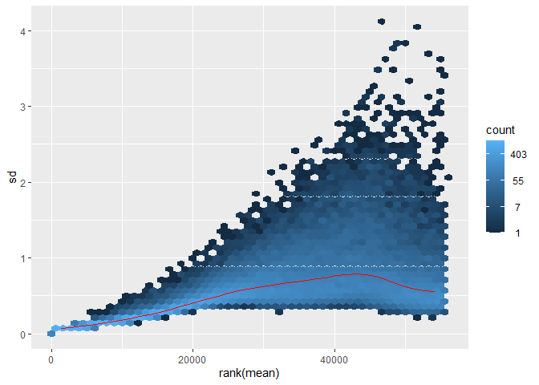
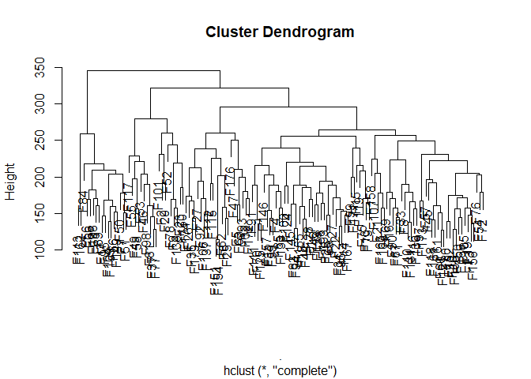
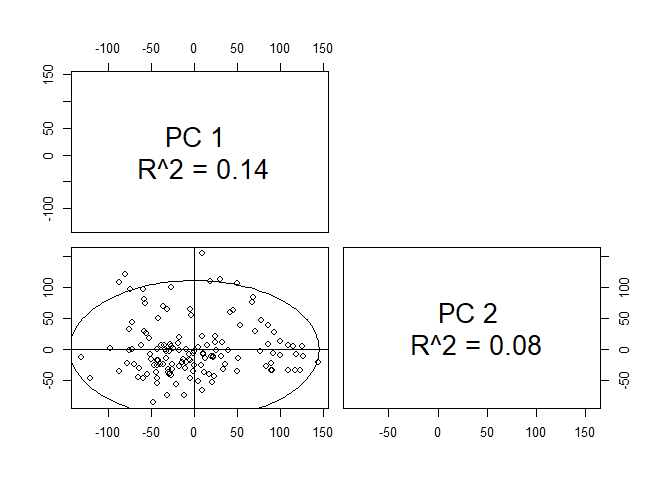

Bulk RNA Seq Normalization and Transformation
================

The aim of this module is to build a unified framework for normalization
and transformation of NGS-based RNA sequencing data after
aligning/counting for further down stream analysis.

Generally speaking, there’s two main ideas how to use this data set
which have different requirements on the data input. 1st is differential
expression analysis (DE) and 2nd is everything else starting from
clustering/visualization, network analysis, integration into multi-omics
analyses etc. While the former is best done within a designated
framework (i.e. edgeR, voom/limma or DESeq2), the latter can be done in
various ways. However, as already outlined above, clustering and
visualization is best done not on the count but on log2 transformed
data.

Furthermore, for an exploratory, high-troughput projects like this,
resarch questions are hard to generalize a priori but rather follow a
very thorough data exploration.

The main difference between edgeR and DESeq used to be the modelling of
the genes dispersion for the negativ binomial distribution. However,
DESeq2 now, similiary to edgeR, shrinks dispersion towards a gene-set
wide dispersion. Nowadays, the main difference lies in some default
settings when using either package for DE expression analysis.

Normalization of RNA sequencing count data aims to correct counts for
differences in i) sequencing depth ii) transcript length and iii)
“real-estate” (this notion is used to describe the fact that sequencing
space is limited, hence a few highly expressed transcripts take up space
biasing). See for example
<https://hbctraining.github.io/DGE_workshop_salmon_online/lessons/02_DGE_count_normalization.html>

For large-scale studies where the main concern is running between-sample
comparisons, normalized counts (edgeR’s TMM or DESeq2s MRN) appear to be
the best suited tools (see <https://doi.org/10.1186/s12967-021-02936-w>)

After count normalization, for clustering and visualization correcting
for the mean-variance-dependency is needed. This can be achived by using
log2 transformation of pseud-counts (+1 to avoid log2(0)). However, more
robust, log2-like transformations such as vst or rlog are available.

For the workflow we will use the aligned RNA sequencing count data from
the AML Mito project <https://doi.org/10.1016/j.ccell.2022.02.006>.
Unaligned reads can be found on the EGA at EGAS00001005950.

Data quality control was performed with FastQC v0.11.9. Reads were
aligned to the human reference genome (Ensembl GRCh38 release 82) using
STAR v2.6.1. Gene count tables were generated while mapping, using
Gencode v31 annotations. All downstream analyses were carried out using
R v4.0 and BioConductor v3.12 (Huber et al., 2015; R Core Team, 2020).

``` r
library(tidyverse)
library(DESeq2)
```

``` r
rnaseq_count_table <- read_delim("~/Forschung/AG Oellerich/Mito Klinisch/AML Mastertabelle/Sequenzierung/RNASeq/fc200808_rnaseq_frankfurt_cohort_count_table.tsv", delim = "\t") %>% 
  rename("sample.id" = "ensembl_id")
```

The data set includes 60662 unique transcripts identified in 137 samples
from treatment-naive AML patients.

DESeq2 works with the DESeqDataSet class which is an extension of the
RangedSummarizedExperiment class of the SummarizedExperiment package.
There are several functions to parse various data formats into a
DESeqDataSet. For our example, we input the count matrix. Alternatives
include parsing for example aligner output data formats.

In our example, the first column “sample.id” is the Ensembl transcript
ID + version. Since the version is usually not matched, we’ll omit this
information

There’s a special case for the 45 transcripts from pseudoautosomal
regions of the Y chromosome which are identified by \_PAR_Y

With the exception of two very lowly expressed genes, they’re all
zero-count genes. Hence for convenience, we’ll remove them from the data
set.

``` r
rnaseq_count_table %>% 
  # identify par_y genes
  filter(grepl("PAR_Y", ensembl_id)) %>% 
  rowwise() %>% 
  # calculate gene-wise sum
  mutate(count = sum(c_across(cols = -ensembl_id))) %>% 
  dplyr::select(ensembl_id, count)
```

    # A tibble: 45 × 2
    # Rowwise: 
       ensembl_id               count
       <chr>                    <dbl>
     1 ENSG00000228572.7_PAR_Y      0
     2 ENSG00000182378.14_PAR_Y     0
     3 ENSG00000178605.13_PAR_Y     0
     4 ENSG00000226179.6_PAR_Y      0
     5 ENSG00000167393.17_PAR_Y     0
     6 ENSG00000281849.3_PAR_Y      0
     7 ENSG00000275287.5_PAR_Y      0
     8 ENSG00000280767.3_PAR_Y      0
     9 ENSG00000234958.6_PAR_Y      0
    10 ENSG00000229232.6_PAR_Y      0
    # … with 35 more rows

``` r
rnaseq_count_table %>%
  # remove par_y genes
  filter(!grepl("PAR_Y", ensembl_id)) %>% 
  # remove id version by regex
  mutate(ensembl_id = stringr::str_extract(string = ensembl_id, pattern = "ENSG\\d{1,}"))  -> rnaseq_count_table
```

Furthermore, we remove all 0 genes

``` r
rnaseq_count_table %>% 
  column_to_rownames("ensembl_id") %>% 
  as.matrix() -> rnaseq_count.matrix

rnaseq_count.matrix.allzero <- matrixStats::rowAlls(rnaseq_count.matrix, value = 0)

rnaseq_count.matrix[!rnaseq_count.matrix.allzero, ] -> rnaseq_count.matrix
```

For this example, we use only minimal sample annotation data that is
immediately available from the data set.

``` r
colnames(rnaseq_count_table) %>% head(5)
```

    [1] "ensembl_id"              "2150466_MLL_165443_P000"
    [3] "3384777_MLL_73859_M026"  "3852810_MLL_165423_M078"
    [5] "8033904_MLL_159630_M053"

The sample names are comprised of two ids, the first from beginning of
string to \_, and the second in the middle. We’ll extract the first id
for sample identification but keep the full sample name in the colData
object

``` r
phen_data_ffm <- readxl::read_excel("~/Forschung/AG Oellerich/Datensätze/FFM_Discovery_Cohort/FFM_AML_Discovery_Cohort.xlsx") %>% 
  janitor::clean_names()

tibble(sample_fullname = colnames(rnaseq_count_table)) %>% 
  # first column is the ensembl_id
  dplyr::slice(-1) %>% 
  mutate(sample_id = stringr::str_extract(string = sample_fullname, pattern = "\\d{1,}")) %>% 
  mutate(sample_id = as.numeric(sample_id)) %>% 
  left_join(dplyr::select(phen_data_ffm, mpi, id), by=c("sample_id" = "mpi")) -> sample_data
```

Since we’re not planning to run any DE analysis, we don’t need a design
formula. Otherwise, we’d need an additional condition factor-column.

``` r
colnames(rnaseq_count.matrix) <- sample_data$id

DESeq2::DESeqDataSetFromMatrix(countData = rnaseq_count.matrix,
                                   colData = sample_data,
                                   # no design
                                   design = ~ 1) -> rnaseq_deseq
```

``` r
rnaseq_deseq
```

    class: DESeqDataSet 
    dim: 55562 136 
    metadata(1): version
    assays(1): counts
    rownames(55562): ENSG00000223972 ENSG00000227232 ... ENSG00000277196
      ENSG00000278625
    rowData names(0):
    colnames(136): F1 F2 ... F177 F179
    colData names(3): sample_fullname sample_id id

After we’ve successuflly created the DESeq object, we need to estimate
the size factors used for MRN-normalization. Currently, this information
is missing

``` r
sizeFactors(rnaseq_deseq)
```

    NULL

``` r
estimateSizeFactors(rnaseq_deseq) -> rnaseq_deseq
```

Confirm the successful calculation of the size factors

``` r
sizeFactors(rnaseq_deseq)
```

           F1        F2        F4        F5        F6        F7        F8        F9 
    1.1354655 1.0869703 1.0906937 1.0777551 1.1487157 1.0692057 0.8840313 0.6634308 
          F10       F13       F14       F15       F16       F17       F18       F19 
    1.4746606 1.0028252 1.0376463 0.7565608 1.2282810 0.7945807 1.1363084 1.5264158 
          F20       F21       F22       F23       F25       F26       F27       F28 
    1.4227712 1.3717922 0.9129586 0.6740961 0.8898294 0.7368347 0.9343715 0.9397257 
          F29       F31       F32       F33       F34       F35       F37       F38 
    0.8670320 1.2001360 0.9702121 0.8665774 1.2811255 0.8792711 0.9627391 1.1602705 
          F42       F44       F45       F46       F47       F49       F50       F51 
    0.9405607 1.1810513 0.7476875 0.6682135 0.8458085 0.4867471 1.1222276 1.0147904 
          F52       F53       F54       F55       F56       F57       F58       F59 
    1.2379651 0.7947544 0.9941132 0.6561116 0.6632676 0.7105403 0.5764112 1.5045132 
          F60       F61       F62       F63       F65       F66       F67       F68 
    0.9701744 1.1287002 1.2119427 1.1226403 1.0446092 1.1485310 0.7522984 1.0022833 
          F69       F70       F71       F72       F73       F75       F76       F77 
    0.7543275 0.9900369 0.9518642 0.6530367 1.4549340 0.9635043 1.5053963 0.9651605 
          F78       F79       F80       F81       F83       F84       F85       F89 
    1.1247682 1.1723865 0.8908687 1.0681803 1.1893747 0.6057178 1.1442054 1.1723873 
          F90       F91       F92       F93       F94       F95       F96       F97 
    1.2347969 0.8806833 1.2125599 0.9846678 1.2231512 1.0066885 1.1946142 1.1337757 
          F98       F99      F100      F101      F103      F104      F105      F106 
    1.0517760 0.9145718 0.9932548 0.8592680 0.9642971 1.0506369 0.9438587 0.8470250 
         F107      F108      F109      F110      F111      F112      F113      F115 
    1.0156739 1.1104262 0.7351547 1.1749028 1.2366276 1.0374623 0.4023945 1.0190062 
         F116      F117      F118      F119      F121      F124      F125      F127 
    1.1166776 0.9538568 0.9880453 1.0654945 1.2331402 1.8632263 1.3103736 1.1022126 
         F128      F130      F131      F133      F136      F137      F145      F146 
    1.0724562 1.0051853 1.1324925 0.8728234 0.7241170 0.8432622 1.0663572 1.0153575 
         F149      F150      F151      F152      F154      F156      F157      F158 
    1.0331938 1.3210258 1.5569209 1.2063655 0.7879254 1.0368449 1.4421029 1.0560126 
         F160      F161      F162      F163      F165      F166      F167      F168 
    0.9527046 1.5604494 0.6129084 1.0508923 1.0167791 1.0772168 1.0951837 1.4026951 
         F169      F171      F172      F173      F174      F176      F177      F179 
    1.5629910 0.6375126 1.4638176 1.1610646 1.2543824 1.1036725 1.1314268 1.1627775 

With the calculated size factors we can proceed with the transformation.
Given the size of the data set, vst is more computationally efficient
compared to rlog. Both methods project the data into a log2-like space.

Note: vst normalized the data prior to transformation!

``` r
vst(rnaseq_deseq, blind = T, nsub = 10000) -> rnaseq_deseq
```

Finally, we can create some exploratory data analyses.

Mean-Variance plot

``` r
vsn::meanSdPlot(assay(rnaseq_deseq))
```



Dendrogram of hierarchical clustering

``` r
assay(rnaseq_deseq) %>% 
  t() %>% 
  #head(1000) %>% 
  dist(method = "euclidean") %>% 
  hclust() %>% 
  plot()
```



``` r
# identify 1000 most variant genes
most_variant_genes <- 
  rowVars(assay(rnaseq_deseq)) %>% 
  order(decreasing = T) %>% 
  head(1000)

# pca plot with the 1000 most variant genes
assay(rnaseq_deseq) %>% 
  t() %>% 
  #head(1000) %>% 
  pcaMethods::pca() %>% pcaMethods::plotPcs()
```



``` r
#saveRDS(assay(rnaseq_deseq), file = "rnaseq_vst.RDS")
```

``` r
sessionInfo()
```

    R version 4.2.0 (2022-04-22 ucrt)
    Platform: x86_64-w64-mingw32/x64 (64-bit)
    Running under: Windows 10 x64 (build 22621)

    Matrix products: default

    locale:
    [1] LC_COLLATE=German_Germany.utf8  LC_CTYPE=German_Germany.utf8   
    [3] LC_MONETARY=German_Germany.utf8 LC_NUMERIC=C                   
    [5] LC_TIME=German_Germany.utf8    

    attached base packages:
    [1] stats4    stats     graphics  grDevices utils     datasets  methods  
    [8] base     

    other attached packages:
     [1] DESeq2_1.36.0               SummarizedExperiment_1.26.1
     [3] Biobase_2.56.0              MatrixGenerics_1.8.0       
     [5] matrixStats_0.62.0          GenomicRanges_1.48.0       
     [7] GenomeInfoDb_1.32.3         IRanges_2.30.0             
     [9] S4Vectors_0.34.0            BiocGenerics_0.42.0        
    [11] forcats_0.5.2               stringr_1.4.1              
    [13] dplyr_1.0.9                 purrr_0.3.4                
    [15] readr_2.1.2                 tidyr_1.2.0                
    [17] tibble_3.1.7                ggplot2_3.3.6              
    [19] tidyverse_1.3.2            

    loaded via a namespace (and not attached):
     [1] googledrive_2.0.0      colorspace_2.0-3       ellipsis_0.3.2        
     [4] snakecase_0.11.0       XVector_0.36.0         fs_1.5.2              
     [7] rstudioapi_0.14        hexbin_1.28.2          farver_2.1.0          
    [10] affyio_1.66.0          bit64_4.0.5            AnnotationDbi_1.58.0  
    [13] fansi_1.0.3            lubridate_1.8.0        xml2_1.3.3            
    [16] codetools_0.2-18       splines_4.2.0          cachem_1.0.6          
    [19] geneplotter_1.74.0     knitr_1.40             jsonlite_1.8.0        
    [22] broom_1.0.1            annotate_1.74.0        vsn_3.64.0            
    [25] dbplyr_2.2.1           png_0.1-7              BiocManager_1.30.18   
    [28] compiler_4.2.0         httr_1.4.4             backports_1.4.1       
    [31] assertthat_0.2.1       Matrix_1.4-1           fastmap_1.1.0         
    [34] limma_3.52.1           gargle_1.2.0           cli_3.3.0             
    [37] htmltools_0.5.3        tools_4.2.0            gtable_0.3.0          
    [40] glue_1.6.2             GenomeInfoDbData_1.2.8 affy_1.74.0           
    [43] Rcpp_1.0.8.3           cellranger_1.1.0       vctrs_0.4.1           
    [46] Biostrings_2.64.0      preprocessCore_1.58.0  xfun_0.32             
    [49] rvest_1.0.3            lifecycle_1.0.1        XML_3.99-0.10         
    [52] googlesheets4_1.0.1    zlibbioc_1.42.0        scales_1.2.1          
    [55] vroom_1.5.7            pcaMethods_1.88.0      hms_1.1.2             
    [58] parallel_4.2.0         RColorBrewer_1.1-3     yaml_2.3.5            
    [61] memoise_2.0.1          stringi_1.7.6          RSQLite_2.2.14        
    [64] genefilter_1.78.0      BiocParallel_1.30.3    rlang_1.0.4           
    [67] pkgconfig_2.0.3        bitops_1.0-7           evaluate_0.16         
    [70] lattice_0.20-45        labeling_0.4.2         bit_4.0.4             
    [73] tidyselect_1.1.2       magrittr_2.0.3         R6_2.5.1              
    [76] generics_0.1.3         DelayedArray_0.22.0    DBI_1.1.3             
    [79] pillar_1.8.1           haven_2.5.1            withr_2.5.0           
    [82] survival_3.4-0         KEGGREST_1.36.3        RCurl_1.98-1.7        
    [85] janitor_2.1.0          modelr_0.1.9           crayon_1.5.1          
    [88] utf8_1.2.2             tzdb_0.3.0             rmarkdown_2.16        
    [91] locfit_1.5-9.6         grid_4.2.0             readxl_1.4.1          
    [94] blob_1.2.3             reprex_2.0.2           digest_0.6.29         
    [97] xtable_1.8-4           munsell_0.5.0         
